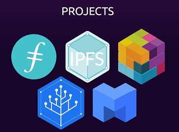
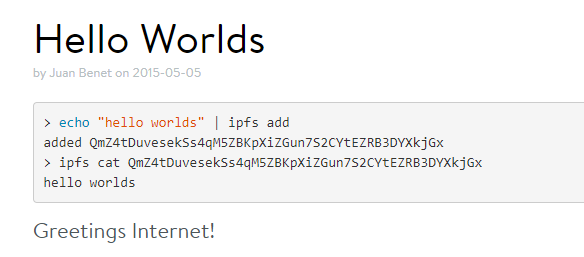
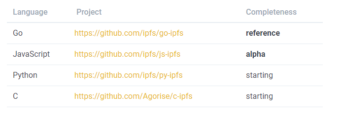
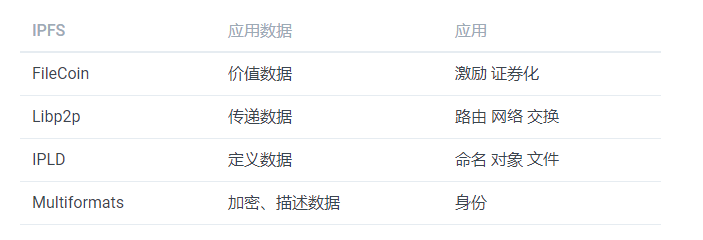
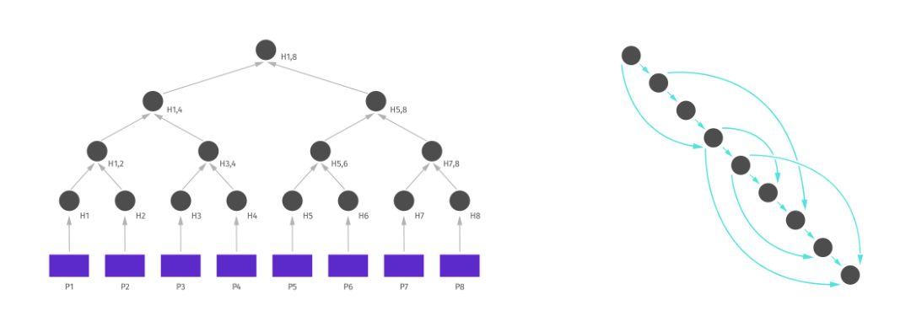

# 初识 IPFS

## 1.1 IPFS 历史

 2018 年 1 月  《纽约时报杂志》发表了一篇 “Beyond the Bitcoin Bubble” [^1] 的文章，在这篇文章我们第一次对 IPFS 的创立者  Juan Benet [^2] 有了一个近距离的了解。

 Juan Benet[^3]  出生于墨西哥，他的本科和硕士就读于斯坦福大学，在斯坦福读硕士的期间创立  Loki studios，担任联合创始人和 CTO，这是一家手游公司，后来被雅虎收购。2011年入驻斯坦福学生创业孵化中心 StartX EIR，2012年，毕业后创办了 Athena，一年多的时间后，于2014年5月份创办协议实验室（Protocol Labs）[^4]。

> Protocal Labs 刚创立就得到美国硅谷顶级孵化器 Y-Combinator 的青睐，并且 Y-Combinator 以《PFS, CoinList, and the Filecoin ICO with Juan Benet and Dalton Caldwell 》[5] 对他们做了一个专访，Protocol Labs 在创建 IPFS 的时候给它取名为“InterPlanetary File System（星际文件传输）”也具有深刻的含义。Protocol Labs 希望构建一个点对点的分布式文件系统，通过底层协议，让全世界所有人都能够轻松从 IPFS 系统上获取信息，且不受防火墙的影响。甚至如果科技发展到一定程度，需要进行星球与星球信息传输时，IPFS 也可以提供快速存储文件的服务。

Juan Benet和他的女友现在住在位于加州帕洛阿尔托市郊的一个小巷的三居室出租屋里，除此之外还有一些属于协议实验室（Protocol Labs）的开发人员也经常过来聚在一起。 

Juan Benet 现年 29 岁，他认为自己是上世纪 90 年代末和 21 世纪初曾短暂繁荣过的第一场 P2P 革命的孩子，那场革命在很大程度上是由像 BitTorrent 这样通常是非法地传播媒体文件的网络推动的。他创建的协议实验室（Protocol Labs） 的第一个项目就对互联网文件系统的彻底改革，这不是他偶尔的心血来潮而是源自于他长久以来的深入思考[^6]。Juan Benet 把他的系统称为 **IPFS**，这是「星际文件系统（InterPlanetary File System）」的缩写。

## 1.2 IPFS 与 Protocol Labs

Protocol Labs 成立于2014年5月，由 IPFS 和 Filecoin 的发明人 Juan Benet 创立。那年夏天，Protocol Labs 参加了 [YCombinator](https://ycombinator.com/) 计划（S14）。他们通过新的技术突破，出色的用户体验设计和开源的创作方法来解决互联网文件系统的问题。在他们看来，互联网是人类最重要的技术，他们致力于信息的存储、定位和就传输。 IPFS项目的成功，离不开Protocol Labs团队和开源社区的努力，一个项目的成功不可能只依靠个人，开源社区集合了大量的贡献者，将他们的超凡学识和过人技能分享给世界，让项目更加完善并取得突破。每一个项目背后都是贡献者的努力付出的成果。

Protocol Labs 目前包括五个项目，项目彼此独立又联系，就目前来说，这个家族成员都在为了更安全、高效、开放的网络而努力。它们分别是：

+ IPFS：星际文件系统，一个旨在创建持久且分布式存储和共享文件的网络传输协议。
+ FileCoin[^7]：IPFS 的激励项目，一个加密货币驱动的存储网络。矿工通过为分布式存储网络提供开放的硬盘空间，赚取 Filecoin；用户则花费 Filecoin，将文件加密存储于去中心化网络。
+ Libp2p[^8]： 模块化的网络堆栈项目。libp2p 汇集了各种传输和点对点协议，使开发人员可轻松构建大型，稳定的p2p网络。
+ IPLD[^9]：分布式网络数据模型. 它通过加密哈希算法连接数据，以更好实现数据交换和链接。
+ Multiformats[^10]：安全系统的协议集合，自我描述格式可以让系统互相协作和升级。

## 1.3 IPFS 现状

2017年9月7日 IPFS 进行了首次进行公开拍卖以筹集资金。短短60分钟就完成筹集2亿美元的目标。Protocol Labs 投资有：USV、YCombinator，还有多位著名投资人，如 Skype 联合创始人 Jaan Tallinn、Coinbase 联合创始人 Fred Ehrsam、美国硅谷知名投资人 Naval Ravikant 等。同时，Protocol Labs 还获得了高校的青睐。其中最引人瞩目的是 IPFS 创始人的母校——美国斯坦福大学也参与投资，斯坦福大学是世界名校，为硅谷的形成和崛起奠定了坚实的基础，培养了许多高科技公司的领导者，包括谷歌、雅虎、耐克、Snapchat、EA、NVIDIA、思科及 LinkedIn 等公司的创办人。

从 Juan Benet 在2015年5月5日在IPFS 网络上存储第一段数据 `Hello World`[^11] 开始，目前已经发展到 7k+ star， 200位代码贡献者。go-ipfs 版本也迭代到 0.4.18 版本。

IPFS 协议包括4种不同语言的实现：

IPFS 官方在 github 上建立了一个 awesome-ipfs[^12] 的项目，在这里我们能找到很多在 IPFS 基础上构建的工具和项目。比如：

 + dtube  一个利用区块链和P2P技术的分散式视频平台。
 + ipfs-search  基于 IPFS 网络的搜索引擎
 + Orbit  基于 IPFS 的分布式，P2P 的聊天软件
 + ujo 为音乐家服务的在线商店
 + 。。。。

## 1.3 IPFS 系统架构

IPFS 采取分层模块化的设计方案，每个模块都可以有多种实现。IPFS 一共分为5层：

+ **naming**       基于 PKI 的一个命名空间(IPNS)。
+ **merkledag**     IPFS 数据结构格式
+ **exchange**   节点之间数据的交换和复制
+ **routing**         用于节点和对象寻址
+ **network**       用于节点的连接和数据的传输

站在数据的角度，我们可以换一种方式来理解 IPFS 的协议：

### 1.3.1  IPFS 网络层

网络层负责在IPFS节点之间提供点对点传输（可靠或者不可靠）。 它的任务主要是：

+ NAT穿透： UDP和TCP打洞、端口映射或者 TURN的方式。
+ 支持多种网络协议： TCP, SCTP, UTP, ...
+ 支持数据加密，签名和信道释放
+ 支持多路复用：复用连接，流，协议，节点，......

### 1.3.2  IPFS 路由层

IPFS 路由层有两个重要目的：

+ 节点寻址：寻找其他节点
+ 内容寻址：寻找发布在网络中的内容

路由层可以针对不同的场景采用不同的实现，例如：

+ DHT：在网络中采用分布式的方式缓存路由记录
+ mdns：用于本地查找
+ snr：采用委派寻址，委托给超级节点，让它来帮助寻址
+ dns：IPFS 可以在 dns 之上进行寻址

### 1.3.3  IPFS 交换层

IPFS 交换层负责数据的传输，一旦节点互相连接上，交换协议就会开始对数据的传输进行控制。同样的交换层也可以有多种实现方式：

+ Bitswap：IPFS 的主要交换协议
+ HTTP：基于 http 协议实现的简单数据交换方式

### 1.3.4 IPFS merkledag

Merkle DAG拥有如下的功能：

+ 内容寻址：使用多重哈希来唯一识别一个数据块的内容
+ 防篡改：可以方便的检查哈希值来确认数据是否被篡改
+ 去重：由于内容相同的数据块哈希是相同的，可以很容去掉重复的数据，节省存储空间

在 IPFS 网络中，存储文件时，首先会将文件切片，切割成 256KB 大小的文件。之后循环调用`MerkleDAG.Add`方法构建文件 MerkleDAG。 文件 hash 值创建流程：

+ 将切片之后的文件进行`sha-256`运算 
+ 将运算结果选取0~31位 
+ 将选取结果根据`base58`编码，运算结果前追加 Qm 即为最后结果，作为文件的 Hash 值

### 1.3.5 IPFS naming

IPFS 基于内容寻址，文件被切分成多个 block, 每个 block 通过 hash 运算得到唯一的 ID， 方便在网络中进行识别和去重。考虑到传输效率， 同一个 block 可能有多个 copy, 分别存储在不同的网络节点上。 每个 block 都有唯一的 ID，我们只需要根据节点的 ID 就可以获取到它所对应的 block。

在 IPFS 中，一个文件的 Hash 值完全取决于其内容，修改它的内容，其相应的 Hash 值也会发生改变。如果我们把修改前后的文件都添加到 IPFS 网络中，那么我们将可以通过这两个 Hash 值访问到前后两个版本的内容。这种静态特性有利于提高数据的安全，比如 Alice 可以将一份自己签名(私钥加密)的文件放到 IPFS 中，那么即使她后来对文件进行了修改并重新签名和发布，那么之前的文件依然存在，她不能抵赖曾经发布过老版本的文件。但对于一些需要保持动态性的文件来说，比如网页，在新版本出现后，旧版本的内容将毫无意义。并且，总不能要求网页访问者每次要在浏览器中输入不同的 IPFS 地址来访问不同时期的网页吧。

IPNS(Inter-Planetary Naming System)提供了一种为文件增加动态性的解决方案。它允许节点的 PeerID 限定的命名空间提供一个指向具体 ipfs 文件(目录) Hash 的指针，通过改变这个指针每次都指向最新的文件内容，可以使得其他人始终访问最新的内容。

## 本章小结

本章首先对 IPFS 产生的历史、现状进行了回顾，然后对 IPFS 与 Protocol Labs 的关系进行了说明， 最后对 IPFS 的系统架构进行简单的分析，这样读者就能对 IPFS 有一个整体的把握。

下一章我们将会搭建 IPFS 的开发环境，这样我们不仅能让 IPFS 跑起来，还能在上面进行源代码的调试，通过对源代码的调试，深入掌握 IPFS。

## 参考文献

+ [1] https://www.nytimes.com/2018/01/16/magazine/beyond-the-bitcoin-bubble.html​
+ [2] http://juan.benet.ai/​
+ [3] https://www.linkedin.com/in/jbenetcs​
+ [4] https://protocol.ai/​
+ [5] https://blog.ycombinator.com/ipfs-coinlist-and-the-filecoin-ico-with-juan-benet-and-dalton-caldwell/
+ [6] http://juan.benet.ai/data/2014-02-21/lets-solve-data-management​
+ [7] https://filecoin.io/​
+ [8] http://libp2p.io/​
+ [9] http://ipld.io/​
+ [10] http://multiformats.io/​
+ [11] https://blog.ipfs.io/0-hello-worlds/​
+ [12] https://github.com/ipfs/awesome-ipfs

[^1]: https://www.nytimes.com/2018/01/16/magazine/beyond-the-bitcoin-bubble.html​
[^2]: http://juan.benet.ai/​
[^3]: https://www.linkedin.com/in/jbenetcs​
[^4]: https://protocol.ai/​
[^5]: https://blog.ycombinator.com/ipfs-coinlist-and-the-filecoin-ico-with-juan-benet-and-dalton-caldwell/​
[^6]: http://juan.benet.ai/data/2014-02-21/lets-solve-data-management​
[^7]: https://filecoin.io/​
[^8]: http://libp2p.io/​
[^9]: http://ipld.io/​
[^10]: http://multiformats.io/​
[^11]: https://blog.ipfs.io/0-hello-worlds/​
[^12]: https://github.com/ipfs/awesome-ipfs​​