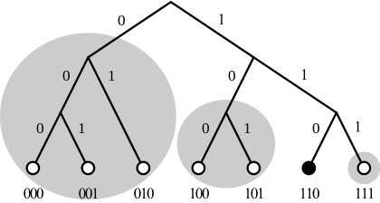
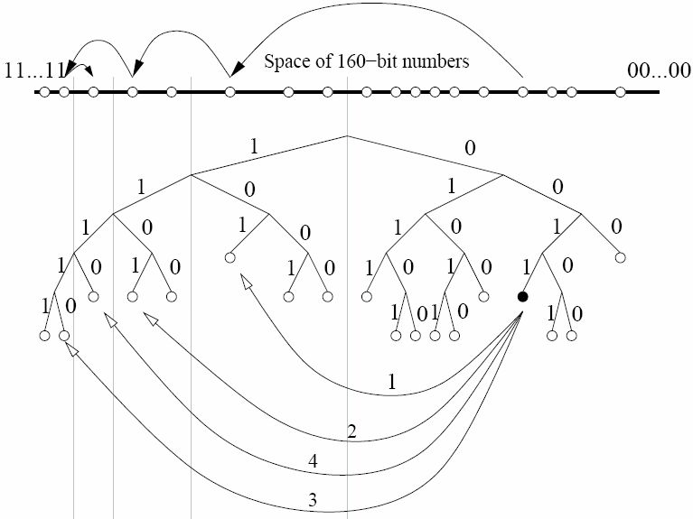

# 3.3 Kademlia（Kad）协议

Kad 诞生于2002年，由纽约大学的（Petar Maymounkov & David Mazières）共同设计[《Kademlia——A Peer-to-peer Information System Based on the XOR Metric》](https://docs.google.com/document/d/1YwjPkWK8roa933-cBnqbP4FtfD_fps7_YXz2_QKyvyY/)。

Kad 的原理比 Chord 复杂一点，目前应用的 DHT 大部分都采用 Kad 及其变种。比如几种知名的 P2P 下载（BT、eDonkey/电驴、eMule/电骡）的 DHT 都是基于 Kad。

## 3.3.1 拓扑结构

### 散列值的预处理

Kad 也采用了`node ID` 与 `data key` 同构的设计思路。然后 Kad 采用某种算法把 key 映射到一个二叉树，每一个 key 都是这个二叉树的**叶子**。

在映射之前，先做一下预处理:

1. 先把 key 以二进制形式表示。
2. 把每一个 key 缩短为它的**最短唯一前缀**。

### 最短唯一前缀”
Kad 使用 160比特 的散列算法（比如 `SHA1`），完整的 `key` 用二进制表示有 160 个数位（bit）。

+ 实际运行的 Kad 网络，即使有几百万个节点，相比 `keyspace（2^160）`也只是很小很小很小的一个子集。
+ 由于哈希函数的特点，key 的分布是**高度随机**的。因此也是高度离散的——任何两个 key 都不会非常临近。
+ 使用**最短唯一前缀**来处理 key 的二进制形式，得到的结果就会很短（比特数远远小于 160）。

### 散列值的映射

完成上述的预处理后，接下来的映射规则是：

1. 先把`key`以二进制形式表示，然后从高位到低位依次处理。
2. 二进制的第`n`个 bit 就对应了二叉树的第`n`层
3. 如果该位是 1，进入左子树，是 0 则进入右子树（这只是人为约定，反过来处理也可以）
4. 全部数位都处理完后，这个`key`就对应了二叉树上的某个**叶子**

**最短唯一前缀**映射到二叉树的叶子

## 3.3.2 距离算法: 异或（XOR）

Kad 采用`XOR`（按位异或操作）算法计算 `key` 之间的**距离**。
这样使得它具备了类似于**几何距离**的某些特性（下面用 `⊕`表示 `XOR`）

	(A ⊕ B) == (B ⊕ A)	XOR 符合交换律，具备对称性。相比之下，Chord 的距离算法不对称
	(A ⊕ A) == 0	反身性，自身距离为零
	(A ⊕ B) > 0	不同的两个 key 之间的距离必大于零
	(A ⊕ B) + (B ⊕ C) >= (A ⊕ C)	三角不等式

## 3.3.3 路由机制

### 二叉树的拆分

对每一个节点，都可以按照自己的视角对整个二叉树进行拆分。

拆分的规则是：

+ 先从根节点开始，把**不包含**自己的那个子树拆分出来；
+ 然后在剩下的子树再拆分不包含自己的下一层子树；
+ 以此类推，直到最后只剩下自己。

Kad 默认的散列值空间是 `m = 160`（散列值有 160 bits），因此拆分出来的子树最多有 160 个（考虑到实际的节点数**远远小于**2160，子树的个数会明显小于 160）。

对于每一个节点而言，当它以自己的视角完成子树拆分后，会得到`n`个子树；对于每个子树，如果它都能知道里面的一个节点，那么它就可以利用这`n`个节点进行递归路由，从而到达整个二叉树的**任何一个**节点。

### K-桶（K-bucket）

每个节点在完成子树拆分后，只需要知道每个子树里面的一个节点，就足以实现全遍历。但是考虑到健壮性（分布式系统的节点随时动态变化），只知道**一个**显然是不够，需要知道**多个**才比较保险。

Kad 论文中给出了一个**K-桶（K-bucket）**的概念。也就是说：每个节点在完成子树拆分后，要记录每个子树里面的`K`个节点。这里所说的`K`值是一个**系统级**的常量。由使用 Kad 的软件系统自己设定（比如 BT 下载使用的 Kad 网络，`K` 设定为 8）。

`K-桶`其实就是`路由表`对于某个节点而言，如果以它自己为视角拆分了`n`个子树，那么它就需要维护 `n`个路由表，并且每个路由表的**上限**是`K`。

`K` 只是一个**上限**，是因为有两种情况使得`K`桶的尺寸会小于`K`。

1. 距离越近的子树就越小。如果整个子树**可能存在的**节点数小于`K`，那么该子树的`K`桶尺寸永远也不可能达到`K`。
2. 有些子树虽然实际上线的节点数超过`K`，但是因为种种原因，没有收集到该子树足够多的节点，这也会使得该子树的`K`桶尺寸小于`K`。

路由过程

### K-桶（K-bucket）的刷新机制

刷新机制大致有如下几种：

1. 主动收集节点
	+ 任何节点都可以主动发起“查询节点”的请求（对应于协议类型 `FIND_NODE`），从而刷新`K`桶中的节点信息。
2. 被动收集节点
	+ 如果收到其它节点发来的请求（协议类型`FIND_NODE`或`FIND_VALUE`），会把对方的 ID 加入自己的某个`K`桶中。
3. 探测失效节点
	+ Kad 还是支持一种探测机制（协议类型`PING`），可以判断某个 ID 的节点是否在线。因此就可以定期探测路由表中的每一个节点，然后把下线的节点从路由表中干掉。

### 并发请求与`α`参数

K 桶的这个设计思路天生支持**并发**。因为同一个 K 桶中的每个节点都是平等的，没有哪个更特殊；而且对同一个 K 桶中的节点发起请求，互相之间没有影响（无耦合）。

所以 Kad 协议还引入了一个参数 **α 因子**，默认设置为 3，使用 Kad 的软件可以在具体使用场景中调整这个 α 因子。

当需要路由到某个子树，会从该子树对应的 K 桶中挑选 **α 个节点**，然后对这几个节点**同时**发出请求。

### 节点的加入

+ 任何一个新来的节点（假设叫 A），需要先跟 DHT 中已有的任一节点（假设叫 B）建立连接。
+ A 随机生成一个散列值作为自己的 ID（对于足够大的散列值空间，ID 相同的概率忽略不计）
+ A 向 B 发起一个查询请求（协议类型 `FIND_NODE`），请求的 ID 是自己（通俗地说，就是查询自己）
+ B 收到该请求之后，（如前面所说）会先把 A 的 ID 加入自己的某个 K 桶中。然后，根据 `FIND_NODE` 协议的约定，B 会找到 K 个最接近 A 的节点，并返回给 A。
+ A 收到这 K 个节点的 ID 之后，（仅仅根据这批 ID 的值）就可以开始初始化自己的 K 桶。
+ 然后 A 会继续向刚刚拿到的这批节点发送查询请求（协议类型`FIND_NODE`），如此往复（递归），直至 A 建立了足够详细的路由表。

### 节点的退出

与 Chord 不同，Kad 对于节点退出没有额外的要求（没有主动退出的说法）。所以 Kad 的节点想离开 DHT 网络不需要任何操作。

## 3.3.4 Kad 的优势

### 简单性

相对于 CAN（Content Addressable Network）——它是最早出现的四个 DHT 协议之一（2001年），CAN 的拓扑结构是基于**多维笛卡尔环面**。与 CAN 的多维环面比起来，Kad 基于二叉树的拓扑结构，就显得非常简单。

Kad 除了拓扑结构很简单，它的距离算法也很简单——只不过是节点 ID 的异或运算（XOR）。

### 灵活性

以 Kad 和 Chord 的路由表来作对比。Kad 的`K-bucket`是可以根据使用场景来调整`K`值，而且对 `K`值的调整完全不影响代码实现。这就是所谓的**设计的弹性**,相比之下，Chord 的`Finger Table`就没有这种灵活性。

### 性能

Kad 的路由算法天生就支持**并发**（参见前面介绍的“α 参数”），而很多 DHT 协议（包括 Chord）没有这种优势。

由于公网上的线路具有很大的不确定性（极不稳定），哪怕是同样两个节点，之间的传输速率也可能时快时慢。由于 Kad 路由请求支持并发，发出请求的节点总是可以获得最快的那个 peer 的响应。

### 安全性

假设某个攻击者想要攻击 Chord 网络的某个节点（假设叫 A），他可以先获得此节点 A 的 ID。知道 节点A 的 ID 后，攻击者就可以运行若干个受控的 Chord 节点（恶意节点），并且精心设置这批恶意节点的 ID；当这批恶意节点加入 Chord 网络后，就可以顺利被添加到 节点A 的路由表中（参见前面对`Finger Table`的介绍）。一旦节点 A 的路由表加入**足够多**的恶意节点，那么节点 A 的路由就有足够大的概率会经过这批恶意节点。攻击者作为这批恶意节点的控制人，就可以对节点 A 做很多手脚。

从理论上讲，类似的手法也可以用来针对 Kad。但是攻击难度会显著变大。原因如下：

+ Kad 协议缺省约定——在线时间越长的节点越可能被加入 K 桶 。所以攻击者哪怕构造了一批恶意节点，这些恶意节点要想被正常节点加入自己的“K桶”，难度也很大。
+ 某个恶意节点（比如叫 X）被正常节点（比如叫 A）加入 K-桶 。由于一个 K-桶 只对应一个子树。所以，只有当节点 A 在针对某个特定子树进行路由的时候，才有可能会碰上这个恶意节点。
+ 即便正好对这个子树路由，也不一定会碰上恶意节点——碰上的概率取决于：K 的大小以及 从桶中选取节点的策略。
+ 前面提到：Kad 协议支持并发查询——每次都会从同一个 K-桶中取出`α`个节点，发出查询请求（参数 α 默认设为 3,可以调大）所以，这`α`个节点中，如果只有一个是恶意的，这个恶意节点也很难捣乱；除非这`α`个节点全部都是恶意的，而这个概率又很小。

再下一节我们会介绍 KAD 协议的升级版本，也就是 IPFS 中用到的**S/Kademlia**协议，S/Kademlia 协议继承了 Kademlia，并且做了一些改进，系统可以防止恶意攻击，例如：女巫攻击、日蚀攻击、敌对路由等。

- [目录](SUMMARY.md)
- 上一节：[Chord 协议](03.2.md)
- 下一节：[S/Kademlia 协议](03.4.md)