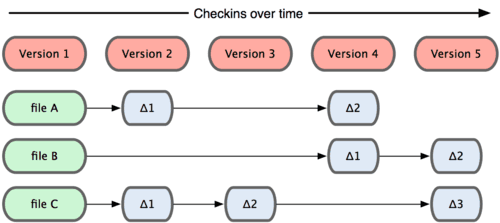
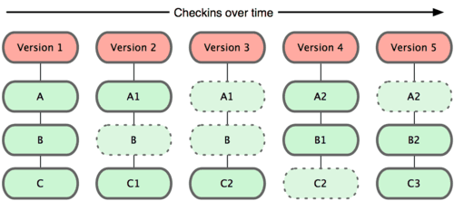
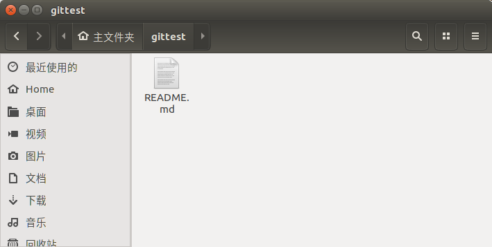
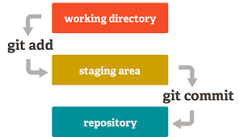
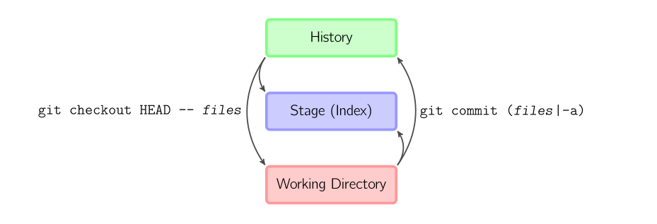

# 3.6 分布式版本控制(Git)

Git 是一个内容寻址文件系统，并在此之上提供了一个版本控制系统的用户界面，它是一个非常强大且易用的工具，IPFS 借鉴了 Git 的工作原理。

## 3.6.1 直接记录快照，而非差异比较

Git 和其他版本控制系统的主要差别在于，Git 只关心文件数据的整体是否发生变化，而大多数其他系统则只关心文件内容的具体差异。这类系统（CVS，Subversion，Perforce，Bazaar 等等）每次记录有哪些文件作了更新，以及都更新了哪些行的什么内容：

Git 并不保存这些前后变化的差异数据。实际上，Git 更像是把变化的文件作快照后，记录在一个微型的文件系统中。每次提交更新时，它会纵览一遍所有文件的指纹信息并对文件作一快照，然后保存一个指向这次快照的索引。为提高性能，若文件没有变化，Git 不会再次保存，而只对上次保存的快照作一链接。Git 的工作方式就如下图所示:

这是 Git 同其他系统的重要区别。它完全颠覆了传统版本控制的套路，并对各个环节的实现方式作了新的设计。Git 更像是个小型的文件系统，但它同时还提供了许多以此为基础的超强工具，而不只是一个简单的 VCS。

## 3.6.2 工作区和暂存区

Git 和其他版本控制系统的一个不同之处就是有暂存区的概念。

### 工作区(Working Directory)

在电脑中能看到的目录，比如我建立的 gittest 就是一个工作区:

### 版本库(Repository)

工作区中的隐藏目录`.git`，就是 Git 的版本库。

Git的版本库里存了很多东西，其中最重要的就是称为 stage（或者叫 index）的暂存区，还有 Git 为我们自动创建的第一个分支 master，以及指向 master 的一个指针叫 HEAD。

文件添加到版本库的流程图：

通过以上两幅图不难看出，需要提交的文件经过 add 后先都放到暂存区 index (或者叫 stage )中，然后经过 commit 指令，一次性提交暂存区的所有修改到 head。一旦提交后，暂存区清空，同时若对工作区没有做任何修改，那么工作区就是干净的(working directory clean)

### 文件的三种状态

对任何一个文件，在Git内都有三种状态：

+ 已提交(committed)：表示该文件已经被安全的保存在本地数据库中了
+ 已修改(modified)：表示修改了某个文件，但还没有提交保存
+ 已暂存(staged)：表示把已修改的文件放在下次提交时要保存的清单中

所谓的暂存区域只不过是个简单的文件，一般都放在 Git 目录中。有时候人们会把这个文件叫做索引文件，不过标准说法还是叫暂存区域。
我们可以从文件所处的位置来判断状态：

+ Git 目录中保存着的特定版本文件----->已提交状态
+ 作了修改并已放入暂存区域----->已暂存状态
+ 自上次取出后，作了修改但还没有放到暂存区域----->已修改状态

## 3.6.3 重要的 .git 目录

当一个新目录或已有目录执行`git init`时，Git会创建一个`.git`目录。这个目录包含了几乎所有Git 存储和操作的对象。若想备份或复制一个版本库，只需把这个目录拷贝至另一处即可。对于一个全新的版本库，该目录结构如下所示：

+ description文件：仅供GitWeb程序使用
+ config文件：包含项目特有的配置选项
+ info目录：包含一个全局性排除(global exclude)文件，用以放置那些不希望被记录在 .gitignore文件中的忽略模式(ignored patterns)
+ hooks目录：包含客户端或服务端的钩子脚本(hook scripts)
+ HEAD文件：指示目前被检出的分支
+ index文件：保存暂存区信息
+ objects目录：存储所有数据内容
+ refs 目录：存储指向数据（分支）的提交对象的指针

## 3.6.4 基本的 Git 工作流程

+ 在工作目录中修改某些文件。
+ 对修改后的文件进行快照，然后保存到暂存区域。
+ 提交更新，将保存在暂存区域的文件快照永久转储到 Git 目录中。

## 3.6.5 Git命令

以将文件添加到代码库为例进行分析：我们都知道需要两步，第一步add，第二步commit，但为什么要分两步呢？每一步都做了什么呢？

+ git commit -a：相当于运行 git add 把所有当前目录下的文件加入暂存区域再运行 git commit
+ git commit <file_name>：进行一次包含最后一次提交加上工作目录中文件快照的提交，并且文件被添加到暂存区域
+ git checkout HEAD -- <file_name>：回滚到复制最后一次提交

##

- [目录](SUMMARY.md)
- 上一节：[BitTorrent 协议](03.5.md)
- 下一节：[自验证文件系统((SFS)](03.7.md)

## 参考

[1] https://link.jianshu.com/?t=http://www.nowamagic.net/academy/detail/48160210)

[2] https://link.jianshu.com/?t=http://marklodato.github.io/visual-git-guide/index-zh-cn.html